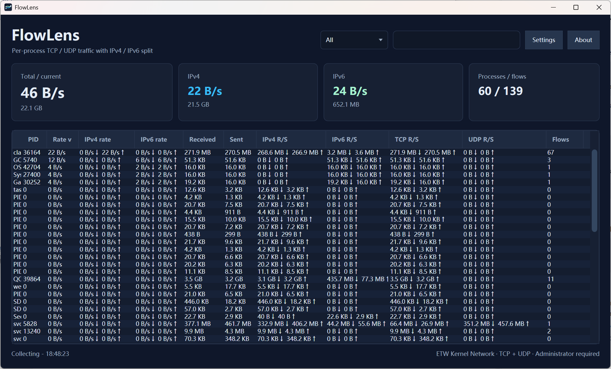

# FlowLens

> This project was developed with the assistance of AI tools.

FlowLens is a lightweight Windows traffic monitor that aggregates TCP and UDP traffic by process, with separate IPv4 and IPv6 statistics.


## Screenshot



## Features

- Per-process TCP and UDP traffic statistics.
- IPv4 and IPv6 receive/send split.
- Real-time rate view plus persisted local statistics.
- Optional time ranges: current session, today, last 7 days, last 30 days, and all.
- Configurable columns, minimum visible traffic threshold, and refresh interval.
- Tray mode, close-to-tray, start with Windows, and start minimized.
- Dark, light, and follow-system themes.
- Optional always-on-top window and bit/s rate display.
- English and Simplified Chinese UI.

## Requirements

- Windows 10/11 x64.
- .NET 8 Windows Desktop Runtime, unless you publish a self-contained build.
- Administrator privileges for ETW network capture.

## Download

Use the `v1.0.1` release package:

```text
FlowLens-1.0.1-win-x64.zip
```

Unzip it and run `FlowLens.exe` as administrator.

## Build

```powershell
dotnet restore
dotnet build .\FlowLens.csproj -c Release
dotnet publish .\FlowLens.csproj -c Release -r win-x64 --self-contained false -p:PublishSingleFile=true
```

## Data

FlowLens stores settings and local traffic history under:

```text
%APPDATA%\FlowLens
```

## Notes

FlowLens counts traffic while it is running. It does not backfill traffic that happened before the app started.

Linux is not supported by this WPF/ETW version. A Linux build would require a separate UI and capture backend.

## License

MIT License.
