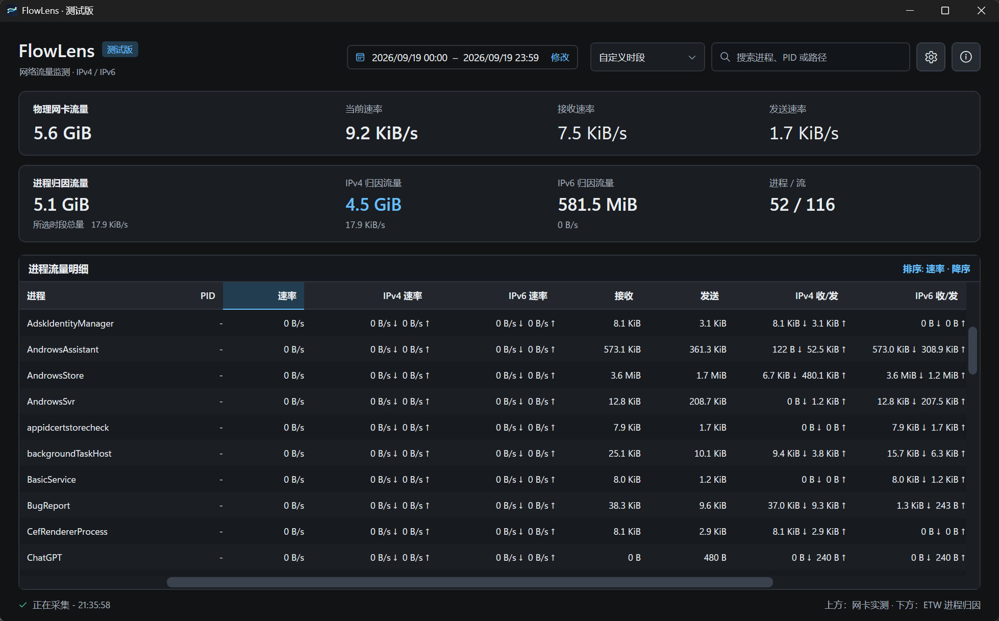

# FlowLens

[English](README.md) | **简体中文**

> 本项目在开发过程中使用了 AI 工具协助。

FlowLens 是一款轻量级 Windows 流量监控工具。它显示所选网卡的物理流量，并按进程归集 TCP 和 UDP 流量，分别统计 IPv4 与 IPv6。


## 界面截图



## 功能

- 分开展示网卡物理流量和按进程归集的逻辑流量。
- 按进程统计 TCP、UDP 流量，并细分 IPv4/IPv6 与接收/发送方向。
- 显示实时速率，并在本地持久保存历史统计。
- 支持本次运行、今天、本月、上月、最近 7 天、最近 30 天、全部历史以及自定义日期和小时。
- 紧凑且可响应窗口宽度的界面；自定义时段控件、日历、工具提示、表格和更新状态均适配主题。
- 可配置显示列、最小可见流量阈值和刷新间隔。
- 支持托盘模式、关闭到托盘、开机启动和启动时最小化。
- 支持深色、浅色、跟随系统主题、窗口置顶，以及以 bit/s 显示速率。
- 支持英文和简体中文界面。
- 可从 GitHub 检查正式版，并在校验后原位更新。

## 系统要求

- Windows 10/11 x64。
- 使用 ETW 捕获网络流量需要管理员权限。
- 官方 Windows x64 自包含包已包括 .NET 运行时，无需另行安装 .NET。

## 下载

从 [GitHub Releases](https://github.com/mgliz/FlowLens/releases/latest) 下载自包含的 [FlowLens 1.0.6 Windows x64 安装包](https://github.com/mgliz/FlowLens/releases/download/v1.0.6/FlowLens-1.0.6-win-x64.zip)：

```text
FlowLens-1.0.6-win-x64.zip
```

解压后，以管理员身份运行 `FlowLens.exe`。

查看 [FlowLens 1.0.6 发布说明](docs/releases/v1.0.6.zh-CN.md)或[完整更新日志](CHANGELOG.zh-CN.md)。

## 构建

```powershell
dotnet restore
dotnet build .\FlowLens.csproj -c Release
dotnet publish .\FlowLens.csproj -c Release -r win-x64 --self-contained true -p:PublishSingleFile=true -p:IncludeNativeLibrariesForSelfExtract=true
```

## 数据位置

FlowLens 将设置和本地流量历史保存在：

```text
%APPDATA%\FlowLens
```

## 统计口径

- 物理流量总量来自 Windows 为所选网络接口报告的字节计数器。
- 进程行来自内核 ETW 事件。TCP 接收端点与 UDP 分别进行方向归一化。发送流量必须从所选网卡发出，接收流量必须以该网卡为目标；本地端点未知的事件不会归入所选网卡。
- VPN、TUN 网卡和透明代理可能同时暴露应用的原始连接与代理或隧道连接。地址筛选可缩小到所选网卡，但 ETW 并非总能找回改写后流量背后的原始应用。进程流量不应作为计费依据。
- IPv4 和 IPv6 总量均包含接收与发送字节。字节量采用二进制单位（KiB、MiB、GiB），1 GiB 为 1,073,741,824 字节。与其他计量结果对比时，应使用相同的日期、方向、单位和网络。
- 如果 Windows 报告 ETW 事件丢失，FlowLens 会显示捕获警告，因为受影响的进程总量可能不完整。

## 更新

打开 **关于 → 检查更新**，即可检查 `mgliz/FlowLens` 的官方 GitHub Release。FlowLens 也可以在启动时检查，每天最多一次；可在设置中关闭。程序只提供正式版。匿名 GitHub API 受到速率限制时，FlowLens 会改用仓库的官方最新 Release 页面和校验和文件，不需要 GitHub Token。

发现较新的正式版后，选择 **下载并更新**。FlowLens 会下载安装包，校验 SHA-256 和可执行文件版本，保存历史数据，在原路径替换可执行文件并重启。原可执行文件的备份会保留在安装目录。取消或预检失败不会改变正在运行的安装。安装失败日志位于 `%APPDATA%\FlowLens\updates`；如果替换后的程序启动失败，更新器会恢复备份，供用户手动重启。设置、历史记录和启动路径都会保留。安装目录必须可写。

测试版还会提供 **切换到正式版**。即使最新正式版的版本号更低，也可以切换，并以正式版替换尚未发布的测试功能。

## 自定义时段与历史限制

选择 **自定义时段**，设置起止日期和小时后点击 **应用**。首尾所选小时都计入：09:00 至 10:00 表示 `[09:00, 11:00)`，界面显示为 09:00–10:59。已应用的范围会显示为紧凑摘要；点击 **修改** 可打开适配主题的浮动编辑器。点击 **取消**、按 Escape 或点击编辑器外部，都会恢复已应用的值。未来日期可见但不可选择。选择会在重启后保留，并同时用于进程总量和网卡物理总量；速率始终显示实时值。

新历史按本地日历小时保存。每个采样间隔归入结束快照所在的小时，因此整点附近的流量可能偏移一个采样间隔——通常为 1 秒，最长可配置为 10 秒。这并不是按数据包时间戳重建。夏令时切换时重复出现的本地小时共用同一个桶。

进程小时历史保存在 `history-v9.json`，网卡历史保存在 `network-history-v8.json`；各个统计桶按实际 Windows 网络接口 ID 隔离。首次启动且新文件不存在时，程序会一次性导入 `history-v8.json` 与 `network-history-v7.json` 中的修正后日统计，并保留原有日键；原文件不会改变。这些导入的日总量只会在所选范围完整包含该日时计入。若范围只覆盖该日的部分小时，则会排除这一天的导入总量，因为无法重建小时明细。更早且统计口径不兼容的历史文件继续隔离保存。

FlowLens 只统计程序运行期间的流量，无法补录启动前的活动。每个完整源快照都会先更新历史，即使界面刷新被合并也不受影响。跨越捕获失败或网卡恢复的间隔只建立新基线，不计入历史。正常退出时，程序会在保存前记录最后一个完整间隔。新的历史文件如果无法读取，程序会阻止保存并保留原文件，不会用回退数据覆盖。

此 WPF/ETW 版本不支持 Linux。Linux 版本需要独立的界面与捕获后端。

## 许可证

FlowLens 依据具有法律效力的英文 [MIT License](LICENSE) 发布。另提供一份仅供理解的[中文译文](LICENSE.zh-CN.md)。
